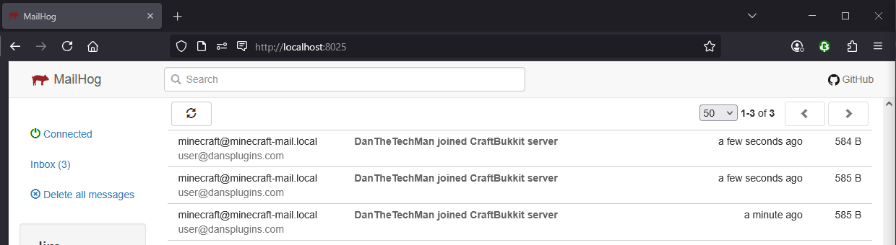

# Herald
Herald is a Minecraft server plugin that sends Discord notifications when players join the server. Email notifications are also supported as a secondary option.



## Features
- **Discord webhook notifications** for player logins (flagship feature)
- Email notification system for player logins (optional, secondary)
- Configurable notification methods (Discord, email, or both)
- Easy to configure and use
- Built-in mail server setup with Docker (for email testing)

## Requirements
- Minecraft server with version 1.16 or higher
- Java runtime environment
- Docker and Docker Compose (optional, for email server setup only)

## Installation
1. Download the Herald plugin JAR file
2. Place the JAR file in your server's `plugins` folder
3. Restart your server or use a plugin manager to load the plugin
4. Configure the plugin settings as needed

## Configuration
After first run, a configuration file will be created that you can modify to set up your notification preferences.

### Herald Plugin Configuration
Update your Herald `config.yml`:

```yaml
# Herald Configuration

# Discord Configuration (flagship feature)
discord:
  enabled: false       # Set to true to enable Discord notifications
  webhook-url: ""      # Your Discord webhook URL

# Email Configuration (optional)
email-recipients: []
smtp:
  server: ""
  port: 587
  username: ""
  password: ""
  use-tls: true
email:
  sender: ""
```

### Setting up Discord Notifications
Discord is the recommended way to receive player join notifications.

1. In your Discord server, go to **Server Settings → Integrations → Webhooks**
2. Click **New Webhook**
3. Configure the webhook:
   - Set a name (e.g., "Herald Bot")
   - Choose the channel where notifications should be sent
   - Copy the webhook URL
4. In your Herald `config.yml`, set:
   - `discord.enabled: true`
   - `discord.webhook-url: "<your-webhook-url>"`
5. Restart your Minecraft server or reload the plugin

Players will then see messages like `**Steve** joined the **My Server** server` in your Discord channel.

You can use Discord notifications alone, email alone, or both together.

#### Testing Discord Without a Minecraft Server
Use the included test scripts to verify your webhook before deploying:

```bash
# Bash (requires Java)
./test-discord-webhook.sh https://discord.com/api/webhooks/YOUR_ID/YOUR_TOKEN

# Python
python3 test-discord-webhook.py https://discord.com/api/webhooks/YOUR_ID/YOUR_TOKEN
```

See [DISCORD_TESTING.md](./DISCORD_TESTING.md) for full documentation.

## Email Server Setup (Optional)
Email is a secondary notification method. If you want to use it, Herald requires an SMTP server. A Docker Compose setup is included for easy local testing.

### Quick Start
1. Make sure Docker and Docker Compose are installed on your system
2. Use the included `compose.yml` file to start the mail services:

    ```shell script
    docker compose up -d
    ```

3. Configure your Herald plugin to use the mail server (see configuration section above)
4. Access the MailHog web interface at http://localhost:8025 to view all sent emails

### Mail Server Architecture
This setup creates two mail-related services:

- **mailserver**: A Postfix mail server that accepts emails from your Herald plugin
- **mailhog**: A mail catcher that captures all outgoing emails for easy viewing

All emails sent to the mail server are relayed to MailHog, where you can view them in a convenient web interface.

## Testing
The Docker Compose setup includes a test Minecraft server that can be used to test the Herald plugin:

```yaml
services:
  testmcserver:
    build: .
    image: herald-test-mc-server
    container_name: herald-test-mc-server
    ports:
      - "25565:25565"
    volumes:
      - type: bind
        source: ./testmcserver
        target: /testmcserver
    environment:
      - MINECRAFT_VERSION=${MINECRAFT_VERSION}
      - OPERATOR_UUID=${OPERATOR_UUID}
      - OPERATOR_NAME=${OPERATOR_NAME}
      - OPERATOR_LEVEL=${OPERATOR_LEVEL}
      - OVERWRITE_EXISTING_SERVER=${OVERWRITE_EXISTING_SERVER}
    networks:
      - mail-network
```

Environment variables can be configured in a `.env` file (sample provided).

## Viewing Emails
All emails sent by the Herald plugin will be captured by MailHog. To view them:

1. Open your web browser
2. Go to http://localhost:8025
3. View and inspect all sent emails in the MailHog interface

## Troubleshooting
- **Discord messages not appearing**: Verify your webhook URL is correct and the channel exists. Run `./test-discord-webhook.sh` to test without a server.
- **Emails not showing up in MailHog**: Make sure your Herald plugin is configured with the correct server address and port.
- **Connection refused errors**: Verify that the Docker containers are running with `docker ps` and that you're using the correct address.
- **Authentication failures**: This setup doesn't require authentication by default; make sure username and password fields are empty in your Herald config.

## Production Usage
This setup is primarily intended for development and testing. For production use:

1. Remove the `RELAYHOST` environment variable from the mailserver service
2. Configure proper DNS records for your mail server
3. Set up TLS certificates for secure email transmission
4. Consider adding spam protection measures

## Building from Source
The project uses the Gradle wrapper for building. This ensures all contributors use the same Gradle version without needing a system install.

```shell
# Build the plugin JAR
./gradlew build

# Run unit tests
./gradlew test

# Build without running tests
./gradlew build -x test
```

On Windows, use `gradlew.bat` instead:
```cmd
gradlew.bat build
gradlew.bat test
```

The built JAR is located at `build/libs/`. The wrapper will automatically download the correct Gradle version on first use.

## Authors
- Daniel McCoy Stephenson