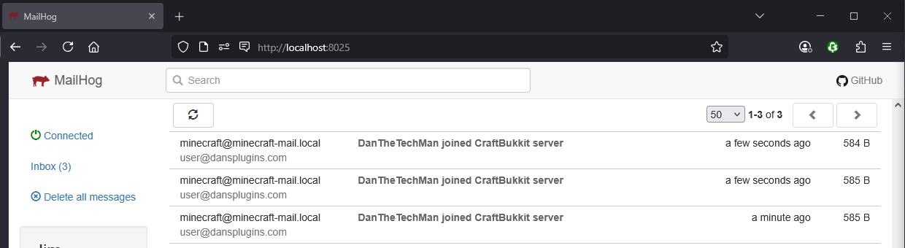

# Herald

## Description

Herald is a Minecraft server plugin that sends Discord webhook notifications when players join the server. Email notifications are also supported as a secondary option.

## Supported Minecraft Versions
This plugin is supported on the Minecraft versions listed in [`minecraft-versions.json`](minecraft-versions.json): currently **1.19.4**, **1.21.11** and **26.2** (Spigot and its forks). Every stable release is booted on a real server of each of these versions before it is published, and the CI `Build` workflow checks that the plugin only uses Bukkit API, and bytecode, that every one of them supports. Other versions from 1.19.4 onwards are expected to work but are not tested. To support another version, add it to the file: both checks pick it up.

## Installation

### First Time Installation

1. Download the Herald plugin JAR file from the [releases page](https://github.com/Dans-Plugins/Herald/releases).
2. Place the JAR in the `plugins` folder of your server.
3. Restart your server.
4. Edit the generated `plugins/Herald/config.yml` to configure notification settings.

### Optional Integrations

Herald can send notifications through Discord webhooks, SMTP email, or both. See the [Configuration Guide](CONFIG.md) for setup details.

## Usage

### Documentation

- [User Guide](USER_GUIDE.md) – Getting started and common scenarios
- [Commands Reference](COMMANDS.md) – Complete list of all commands
- [Configuration Guide](CONFIG.md) – Detailed configuration options
- [Discord Testing](DISCORD_TESTING.md) – Testing Discord webhooks without a server
- [Changelog](CHANGELOG.md) – Release-by-release summary of changes

## Support

You can find the support Discord server [here](https://discord.gg/xXtuAQ2).

### Experiencing a bug?

Please fill out a bug report [here](https://github.com/Dans-Plugins/Herald/issues/new?template=bug_report.md).

- [Known Bugs](https://github.com/Dans-Plugins/Herald/issues?q=is%3Aissue+is%3Aopen+label%3Abug)

## Contributing

- [CONTRIBUTING.md](CONTRIBUTING.md)

## Testing

### Unit Tests

Linux:

    ./gradlew clean test

Windows:

    .\gradlew.bat clean test

If you see `BUILD SUCCESSFUL`, the tests have passed.

## Development

### Test Server

A Docker-based test server is available for development.

#### Setup

1. Copy `sample.env` to `.env` and configure as needed.
2. Build the plugin: `./gradlew build`
3. Start the test server: `./up.sh`

#### Reloading the Plugin

    ./reload-plugin.sh

This rebuilds the plugin, replaces the Herald JAR in the running test server container, and restarts the container so the server starts with the new build. It does not hot-reload the plugin in place, so connected players are disconnected. With `OVERWRITE_EXISTING_SERVER=true` in `.env`, the restart also wipes the server directory, world included, as `./up.sh` does.

#### Stopping the Test Server

    ./down.sh

## Authors and Acknowledgement

### Developers

| Name | Main Contributions |
|------|--------------------|
| Daniel McCoy Stephenson | Creator and lead developer |

## License

This project is licensed under the [GNU General Public License v3.0](LICENSE) (GPL-3.0).

You are free to use, modify, and distribute this software, provided that:

- Source code is made available under the same license when distributed.
- Changes are documented and attributed.
- No additional restrictions are applied.

See the [LICENSE](LICENSE) file for the full text of the GPL-3.0 license.

## Usage reporting

Usage reporting is on by default: when the plugin is enabled, it sends its name and version to the author's [trace](https://trace.danielstephenson.dev) server so it is known which plugins are actually in use. Herald has no commands, so that startup event is the only one. Nothing about players, worlds or IPs is sent, apart from any tags the server's operator adds under `tags:` in `plugins/trace/config.yml`, which go with every event (see the [Configuration Guide](CONFIG.md#usage-reporting)). The plugin says on the console at every start whether reporting is on. Each event also carries a random server ID (the `server-id` line in `plugins/trace/config.yml`) so servers can be counted rather than events. It identifies no person, account or IP address; delete the line to get a new one. To turn it off:

- for this plugin: set `usage-reporting.enabled` to `false` in `plugins/Herald/config.yml`;
- for every plugin on the server that reports to trace: set `enabled` to `false` in `plugins/trace/config.yml` (created on first start);
- for the whole server process: set the environment variable `TRACE_USAGE_REPORTING=off` or `DO_NOT_TRACK=1`.

Details: https://github.com/Stephenson-Software/trace#usage-reporting

## Project Status

This project is in active development.
